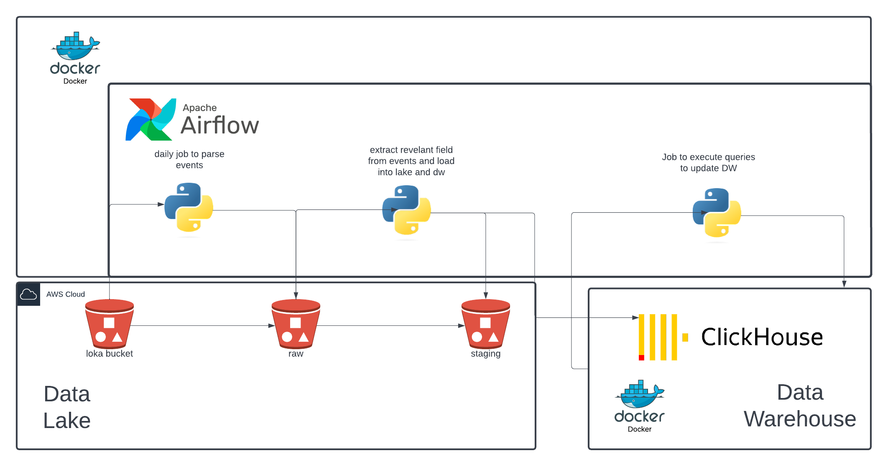
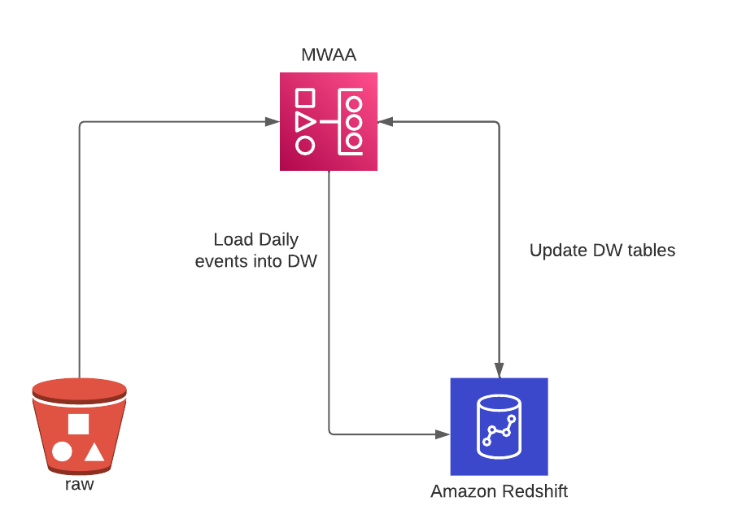
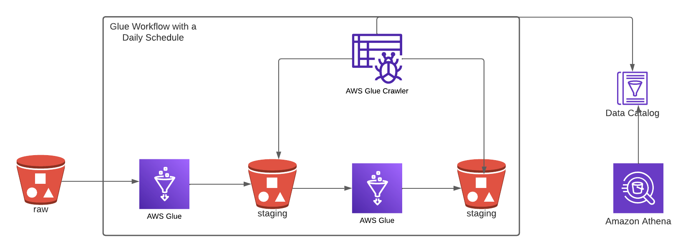

# loka-challenge
Repo for loka challenge

# Requirements
Having `docker` and `docker-compose` installed.

# Env
Create an `.env` file based on the `.env.example`.
Under the `airflow` and `aws_cdk` folder a `requirements.txt` is provided in case you want to setup `venvs` in your machine

# AWS Setup
## Steps
- Replace the `aws_account_id` in the `.env` file for the `RAW_BUCKET` and `STAGING_BUCKET` vars. This is required to guarantee unique naming for the buckets.
- Open AWS Console, as root user, and under the IAM panel create an `User`. Copy the `User ARN` into the `AWS_ROLE_ARN` var in the `.env` file.
Choose an `username` and set `AWS Access type` as `Access key - Programmatic access`
- Attach inline permissions, click on the json tab and copy the `iam_policy.json` provided in this repo. **NOTE**: in that json you will need to replace the `'{account_id}'` with your AWS account id number. The permissions in that json follow the `Least Priveliged` principle.
- Tags can be skipped, but once again in a production environment, should be set atleast a project and env tag. Which can then be used in the `Least Privelige` model.
- Download the `.csv` with `AWS_ACCESS_KEY_ID` and `AWS_SECRET_ACCESS_KEY` and replace the corresponding vars in the `.env` file.
Set as well the `AWS_DEFAULT_REGION`, e.g, `eu-central-1`.

# Airflow Setup
Depending on the operating system you are running this project, some considerations must be taken. These are described [here](https://airflow.apache.org/docs/apache-airflow/stable/howto/docker-compose/index.html).

# Build & Run
Deploy the `AWS Infrastucture`:

```bash
docker build . -f aws_deploy.Dockerfile -t aws_deploy
docker run --env-file=.env aws_deploy bootstrap
docker run --env-file=.env aws_deploy deploy
```

The bootstrap command will ramp up some necessaries resources for CDK in case your account does not have them.

Build `airflow` and `clickhouse` images:

```bash
docker-compose build
```

Run the images:

```bash
docker-compose up airflow-init
docker-compose up
```

Access the `airflow` webserver in `localhost:8080` with the credentials being user: `airflow`, pass: `airflow`
Access clickhouse in `localhost:8123`

# Data Modelling
To optimize querying and data storage, the ingested data, in partitioned and saved in `.parquet` format.
Stages: 

**DATALAKE**

*Raw Bucket*: 

Data is partitioned by `date` and `event_type` and saved as `.parquet`:
`raw_bucket/date=2019-06-01/event=create`
`raw_bucket/date=2019-06-01/event=...`

No transformations besides partitioning are done at this stage, which makes the ingestion simple and reliable.

*Staging Bucket*:

In this stage, the `data` field is flatten, and a folder is created per event_type, which is also partitioned by date:
`staging_bucket/create_events/date=2019-06-01`
`staging_bucket/register_events/date=2019-06-01`

**DW**

The folders created in the staging bucket are replicated in `clickhouse`. One table per event_type is created, also following the same paritioning logic.

Finally, two other tables are created, which the purpose of modelling the staging data. 

**Table** `vehicle_operation_metadata`: Joins the register, unregister and created events, in order to create a daily mapping between `operating_period` and `vehicle_id`


**Table** `vehicle_position_data`: Takes the update events, and create a `driven_meters` col, which applies the `haversine` distance using the provided `lat` and `long` cols between data point per each vehicle, allowing this way to measure driven distance per vehicle per day. 


# Infra Design
## Proposed Solution 
In the image below you can find the proposed solution for this challenge. In terms of infrastructure, it runs 1 `docker` image of `airflow`, that will serve as our job orchestrator, 1 image of `clickhouse` which will be our data warehouse, and as well two `S3 buckets` are deployed using `CDK` to serve as our `datalake`

A daily job run in `airflow` that will extract data from the execution day and load the data into the `datalake` and the `dw`.

## AWS Server based solution
A similar solution could be deployed in `AWS` using a managed `airflow` instance, `MWAA`, and a `Redshift` instance as our `DW`, as described in the diagram below


However, we can take advantage of `serverless` AWS services to recreate the same functionality, while reducing the costs, increasing the effiency and abstracting the complexity of infrastructure.

## AWS Server based solution
Below, an approach to solve this challenge with an infrastucture based in a `serverless datalake`.

Instead of having `airflow` scheduling jobs, `AWS Glue` can be used to process data between `Buckets`. `AWS Glue` also allows and simplifies the use of different processing engines, like `Spark`, which will allow easy scaling if the data size increases. 

In order to keep the data queriable using `SQL`, `Glue` provides `Crawlers` to scan `Buckets` and fill a `Data Catalog` based on the schemas found in the `Buckets`.

This way `AWS Athena` can be used to query `Buckets` using the `Data Catalog`